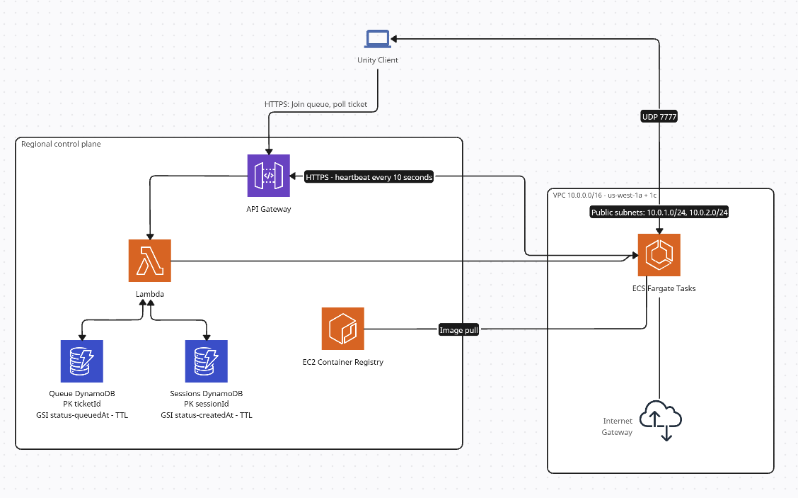

# Custom AWS Matchmaker

Cloud infrastructure for an on-demand multiplayer game backend. Players hit
"Find Match"; a dedicated game server is provisioned on AWS Fargate only once
there are enough players for a match, and it terminates itself when the match
is over.

Nothing runs when nobody is playing. Idle cost is under ten cents a month.

---



The dotted UDP line is the important one: **API Gateway is control plane only.**
It answers "where do I go?" once, then the client talks straight to the Fargate
task. Gameplay traffic never touches the API. It couldn't, since API Gateway
is HTTP and this is a 20 Hz UDP game loop.

### Resource inventory

| Service         | Resource                              | Notes                                                                                                   |
| --------------- | ------------------------------------- | ------------------------------------------------------------------------------------------------------- |
| **VPC**         | `ground-trace-vpc` 10.0.0.0/16        | 2 public + 2 private subnets across `us-west-1a` / `1c`; AZs resolved by data source, not hardcoded     |
|                 | Security group                        | Inbound UDP 7777 from `0.0.0.0/0` — clients connect from arbitrary residential IPs                      |
|                 | _(no NAT gateway)_                    | Deliberate; see design notes                                                                            |
| **ECR**         | `ground-trace-game-server`            | Scan-on-push, lifecycle policy keeps 5 images                                                           |
| **ECS**         | `ground-trace-cluster`                | Fargate only, Container Insights enabled                                                                |
|                 | Task definition rev 4                 | 512 CPU / 1024 MB, `awsvpc`, UDP 7777, env-configured                                                   |
| **Lambda**      | `ground-trace-matchmaker`             | `python3.13`, 256 MB, boto3 only — no dependencies to package                                           |
| **API Gateway** | HTTP API (v2)                         | `POST /queue`, `GET·DELETE /queue/{ticketId}`, `POST /sessions/{id}/heartbeat`, `DELETE /sessions/{id}` |
| **DynamoDB**    | `ground-trace-queue`                  | PK `ticketId`, GSI `status-queuedAt-index`, TTL on `expiresAt`, on-demand                               |
|                 | `ground-trace-sessions`               | PK `sessionId`, GSI `status-createdAt-index`, TTL on `expiresAt`, on-demand                             |
| **CloudWatch**  | `/ecs/ground-trace-game-server`       | 7-day retention                                                                                         |
|                 | `/aws/lambda/ground-trace-matchmaker` | Lambda logs                                                                                             |
|                 | Container Insights                    | Per-task CPU/memory metrics                                                                             |

### IAM

Three roles, each scoped to exactly what assumes it:

| Role                              | Trusted by                | Grants                                                                                                                                                                           |
| --------------------------------- | ------------------------- | -------------------------------------------------------------------------------------------------------------------------------------------------------------------------------- |
| `ground-trace-ecs-task-execution` | `ecs-tasks.amazonaws.com` | Managed `AmazonECSTaskExecutionRolePolicy` — pull from ECR, write logs. Used by the ECS agent, never by game code.                                                               |
| `ground-trace-game-server-task`   | `ecs-tasks.amazonaws.com` | **Nothing.** The game server makes no AWS API calls, so it holds no permissions. Defined so adding one later is a policy change, not a restructure.                              |
| `ground-trace-matchmaker`         | `lambda.amazonaws.com`    | DynamoDB read/write on both tables **and their indexes**, `ecs:RunTask`/`DescribeTasks`/`StopTask`, `ec2:DescribeNetworkInterfaces`, `iam:PassRole` scoped to the two task roles |

Two details in that last row are the ones people get wrong:

- **A GSI is a separate ARN from its table.** Granting `Query` on
  `table/ground-trace-sessions` does not permit querying
  `status-createdAt-index`; the policy needs `table/.../index/*` as well.
- **`iam:PassRole` is distinct from `ecs:RunTask`.** Launching a task means
  handing it two roles, and IAM treats "may I give this role to a service?" as
  its own permission. Granting only `RunTask` produces an AccessDenied that
  reads like the RunTask permission is missing.

### Flow

1. Client `POST /queue` → a ticket row in DynamoDB. No server exists yet.
2. Each join re-evaluates the queue. Once enough players are waiting, their
   tickets are claimed atomically and a server is provisioned or an
   existing server with a free slot is reused.
3. Client polls `GET /queue/{ticketId}` → `waiting` → `provisioning` → `matched`
   with an `{ip, port}`.
4. Client connects directly over UDP. The game's own lobby confirms both
   players actually arrived before starting.
5. The server heartbeats its state every 10s. When the last player leaves, it
   exits, which stops the task and ends billing.

---

## Layout

```
infrastructure/aws/
  main.tf, variables.tf, output.tf
  vpc.tf          VPC via terraform-aws-modules, no NAT gateway
  ecr.tf          image repository + lifecycle policy
  ecs.tf          Fargate cluster, task definition, security group
  dynamodb.tf     queue + sessions tables, both with GSI and TTL
  iam.tf          task execution / task / matchmaker roles
  lambda.tf       matchmaker function, packaged by archive_file
  apigateway.tf   HTTP API, routes, throttling
  lambda/matchmaker/handler.py
scripts/
  run-server.sh   launch one server by hand and print its address
```

---

## Design decisions

### Nothing waits inside a running server

The obvious design is "first player starts a server and waits in it." That
means paying for a container while someone sits alone in a lobby, potentially
for as long as they're willing to wait.

Instead, waiting happens in a DynamoDB row. A server is provisioned at the
moment a match forms. The cost is that both players then wait through a 30–60
second cold start together, rather than the second player arriving to a warm
server.

Production games solve this with **warm pools**, Agones and GameLift both
manage fleets of idle, pre-booted servers so allocation is instant. That trades
continuous spend for latency. At this scale the trade runs the other way.

### The server decides when it's finished

Nothing external reaps a Fargate task. ECS will happily run an empty game
server forever and bill for it. So the server terminates itself once it's been
empty for a configurable window, which stops the task and ends the charge.

Scale-to-zero isn't something the infrastructure does to the workload, the
workload has to participate.

### TTL is garbage collection; `lastHeartbeat` is correctness

Session rows carry a DynamoDB TTL, but TTL is explicitly best-effort: AWS only
promises deletion "typically within 48 hours." A server that dies without
deregistering leaves a row that still looks joinable.

So liveness is decided by age, not by TTL. Observed in practice: a session row
advertised a dead server for **139 seconds** before TTL removed it. Anything
trusting TTL alone would have routed a player to an address with nothing on it.

### Concurrent joins can't double-provision

Two players joining within the same instant produce two Lambda invocations that
both see a full queue. Each ticket is claimed with a conditional `UpdateItem`
(`status` must still be `waiting`), so exactly one invocation wins; the loser
rolls back its claims and leaves its player queued.

Optimistic concurrency, no locks, no coordination service.

### Provisioning never blocks

`RunTask` is called and the request returns immediately with
`status: provisioning`. The client polls until an address appears.

This isn't only elegance: **API Gateway caps integrations at 29 seconds**, and
a Fargate cold start routinely exceeds that. A synchronous design would have
been architecturally doomed rather than merely slow.

### Polling drives IP resolution

A Fargate task cannot discover its own public IP — the address lives on the ENI,
outside the container, and Fargate has no EC2 instance metadata endpoint.
Someone outside has to look it up.

Rather than run a poller on a timer, the client's own status request does it:
if a matched session has no address yet, that request performs the
`DescribeTasks` → `DescribeNetworkInterfaces` lookup and caches the result. No
EventBridge rule, no idle compute.

### Backfill before provisioning

If a live server already has a free slot — someone quit a 1v1 and the match was
abandoned back to its lobby, a single queued player joins it rather than
triggering a second container. Cheaper and faster than a cold start.

### Two IAM roles, not one

- **Task execution role**: assumed by the ECS agent to pull the image and ship
  logs. The application never uses it.
- **Task role**: assumed by the server process itself. Deliberately empty: the
  game server makes no AWS API calls, so it gets no permissions.

Keeping the second role defined-but-empty means adding a permission later is a
policy change, not a restructure.

---

## Cost

|             |                                                                             |
| ----------- | --------------------------------------------------------------------------- |
| Idle        | **< $0.10/month** — ECR storage, a few DynamoDB rows, log retention         |
| Per match   | **~$0.03/hour** — one Fargate task at 0.5 vCPU / 1 GB (`us-west-1`)         |
| Matchmaking | Effectively free — Lambda and API Gateway are per-request at trivial volume |

A ten-minute match costs about half a cent. The single largest cost decision
was deleting one line of Terraform (`enable_nat_gateway`), which was worth more
than every other optimization combined.

### Cost controls

- Servers self-terminate when empty
- `max_concurrent_sessions` caps how many tasks can exist at once, which bounds
  worst-case spend regardless of who is calling the API
- API Gateway throttling (5 req/s, burst 10)
- ECR lifecycle policy expires old images
- Game server logs have a 7-day retention rather than the never-expire default
- An AWS Budgets alarm as the backstop

Container Insights is currently enabled, which publishes per-task CPU and memory
metrics and bills for them. It's on to gather right-sizing numbers; leaving it
off is the cheaper steady state once the task is sized.

---

## Running it

Requires Terraform, the AWS CLI, and Docker.

```bash
cd infrastructure/aws
terraform init
terraform apply          # needs matchmaker_api_key in terraform.tfvars
```

Then build the Unity Linux dedicated server, and from the game repo:

```bash
aws ecr get-login-password --region us-west-1 \
  | docker login --username AWS --password-stdin <account>.dkr.ecr.us-west-1.amazonaws.com
docker build -f Dockerfile.server -t game-server .
docker tag game-server:latest <account>.dkr.ecr.us-west-1.amazonaws.com/ground-trace-game-server:latest
docker push <account>.dkr.ecr.us-west-1.amazonaws.com/ground-trace-game-server:latest
```

`terraform output matchmaker_api_url` gives the endpoint the game client needs.

To launch a server by hand without going through matchmaking:

```bash
bash scripts/run-server.sh
```

It resolves networking by tag, launches one task, waits for `RUNNING`, and
prints the address. The manual version of what the matchmaker automates.
